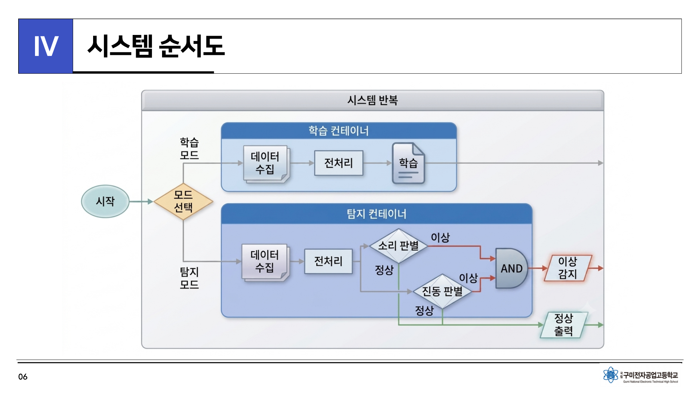
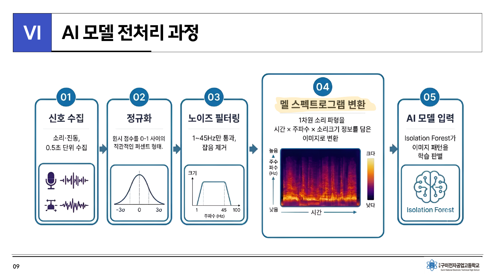
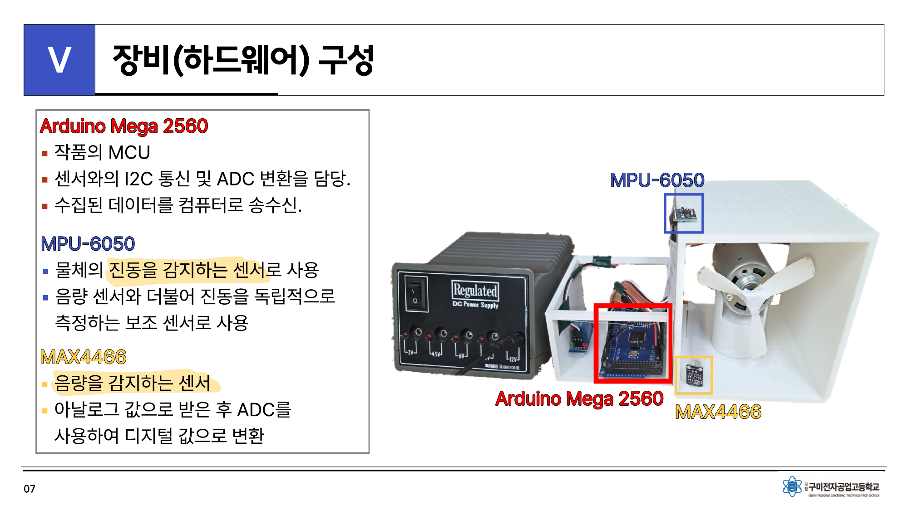
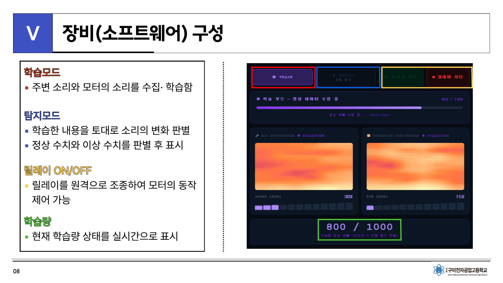

<div align="center">

# Sonic-Expert

**Real-time acoustic & vibration anomaly detection for industrial equipment**

저가 센서와 비지도 학습을 결합한 실시간 설비 이상 탐지 시스템

[](sonic-expert-repo/LICENSE)
[](https://www.python.org/)
[](https://react.dev/)
[](https://firebase.google.com/)
[](https://www.arduino.cc/)
[](#award)

[개요](#개요) · [아키텍처](#아키텍처) · [동작 원리](#동작-원리) · [설치](#설치) · [사용법](#사용법) · [성능](#성능)

</div>

---

## 개요

Sonic-Expert는 산업용 회전 설비의 **소리와 진동을 실시간으로 분석**하여 이상 징후를 조기에 탐지하는 IoT 시스템입니다. 숙련 엔지니어가 청각으로 설비 이상을 감지하는 경험적 직관을 **비지도 학습 기반 AI**로 대체합니다.

핵심 설계 목표는 두 가지입니다.

- **접근성** — 상용 예지보전(PdM) 솔루션이 수백만 원대인 반면, 본 시스템은 약 7.4만 원의 범용 부품으로 구현하여 중소기업의 도입 장벽을 낮춥니다.
- **신뢰성** — 소리·진동을 독립 채널로 판별하고 AND 조건으로 결합하여, 단일 신호의 노이즈로 인한 오탐(false positive)을 억제합니다.

<sub>본 프로젝트는 학습·연구 목적의 프로토타입입니다.</sub>

---

## 아키텍처

```
Arduino  ──Serial──▶  Python Engine  ──Write──▶  Firebase RTDB  ──Subscribe──▶  Web App
(Sensing)             (Inference)                (Realtime Hub)                 (React)
   ▲                                                   │                           │
   └──────────────── Serial command ◀──────────────────┴──── Control command ◀─────┘
```

| 레이어 | 역할 | 스택 |
|--------|------|------|
| **Edge** | 소리·진동 수집(100 Hz), 릴레이 제어 | Arduino Mega 2560, MAX4466, MPU-6050 |
| **Inference** | 신호 전처리 → 특징 추출 → 이상 판별 → 업로드 | Python, librosa, scikit-learn |
| **Cloud** | 양방향 실시간 데이터 허브 | Firebase Realtime Database |
| **Client** | 모니터링, 모드 제어, 릴레이 원격 제어 | React, Vite |

<div align="center">

</div>

---

## 동작 원리

### 신호 처리 파이프라인

```
수집(100Hz) → 정규화(z-score) → 밴드패스 필터(1–45Hz) → 멜 스펙트로그램 → Isolation Forest → 이상 점수
```

<div align="center">

</div>

### 이중 판별 · AND 결합

소리와 진동을 **독립 채널**로 처리하며, 각 채널은 두 기준을 함께 적용합니다.

| 판별 기준 | 방식 | 탐지 대상 |
|-----------|------|-----------|
| **Pattern** | Isolation Forest — 멜 스펙트로그램이 학습된 정상 분포에서 벗어나는지 | 주파수 구성 변화 (마모, 정렬 불량 등) |
| **Level** | 통계적 범위(μ ± 4σ) — 신호 크기가 정상 범위를 벗어나는지 | 급격한 크기 변화 (정지, 과부하 등) |

두 채널이 **모두** 이상으로 판정될 때만 최종 이상으로 결론지어 오탐을 최소화합니다.

### Isolation Forest 채택 근거

| 후보 모델 | 장점 | 본 프로젝트에서의 제약 |
|-----------|------|------------------------|
| One-Class SVM | 명확한 결정 경계 | 고차원(16,384-dim)에서 커널 연산 비용 · 튜닝 난이도 |
| Autoencoder | 높은 표현력 | 대량 학습 데이터 · GPU 의존, 저사양 환경 부적합 |
| **Isolation Forest** | 비지도 · 고차원 강건 · 경량 | — |

Isolation Forest는 데이터 간 거리를 계산하지 않고 무작위 분할의 격리 깊이로 이상치를 판별하므로, 고차원 입력에서도 **차원의 저주에 강건**하며 저사양 PC에서 실시간 추론이 가능합니다.

---

## 하드웨어

<div align="center">

</div>

| 부품 | 역할 | 인터페이스 | 단가(KRW) |
|------|------|-----------|-----------|
| Arduino Mega 2560 | MCU | Serial / I2C | 61,190 |
| MPU-6050 | 진동(가속도) 센서 | I2C | 10,600 |
| MAX4466 | 음량(마이크) 센서 | Analog (ADC) | 1,790 |
| | | **합계** | **73,580** |

**핀 매핑**

| 핀 | 연결 |
|----|------|
| `A0` | MAX4466 OUT |
| `A4` / `A5` | MPU-6050 SDA / SCL |
| `D7` | Relay IN |
| `D10` / `D11` | Mode indicator LED |

전체 명세는 [`docs/BOM.txt`](sonic-expert-repo/docs/BOM.txt) 참고.

---

## 웹 대시보드

<div align="center">

</div>

- 학습(TRAIN) / 탐지(DETECT) 모드 전환
- 소리·진동 멜 스펙트로그램 실시간 렌더링
- 채널별 레벨 게이지 및 이상 점수 시계열 그래프
- 릴레이 원격 ON/OFF 및 학습 진행률 표시

---

## 프로젝트 구조

```
sonic-expert/
├── engine/                       # Python 추론 엔진 + Arduino 펌웨어
│   ├── inference_engine.py       #   시리얼 수신 · 전처리 · 추론 · 업로드
│   ├── cleanup_firebase.py       #   RTDB 데이터 정리 유틸리티
│   ├── requirements.txt
│   └── arduino/
│       └── sonic_sensor.ino      #   센서 수집 · 릴레이 · LED 제어
├── webapp/                       # React 대시보드
│   └── src/App.jsx
├── docs/                         # 문서 · 다이어그램 · 발표자료
└── README.md
```

---

## 설치

### 사전 요구사항

- Python 3.10+
- Node.js 18+
- Arduino IDE
- Firebase 프로젝트 (Realtime Database 활성화)

### 1. Firebase 설정

Realtime Database 생성 시 지역은 `asia-southeast1`을 권장합니다(한국 기준 최저 지연). 개발용 규칙은 다음과 같으며, 운영 시에는 인증이 필수입니다.

```json
{ "rules": { ".read": true, ".write": true } }
```

프로젝트 설정 → 서비스 계정 → 새 비공개 키 생성 → 다운로드한 JSON을 `engine/serviceAccountKey.json`으로 저장합니다. (`serviceAccountKey.example.json` 참고)

### 2. 추론 엔진

```bash
cd engine
pip install -r requirements.txt
# inference_engine.py 의 FIREBASE_DATABASE_URL 을 본인 값으로 수정
```

### 3. Arduino 펌웨어

`engine/arduino/sonic_sensor.ino`를 Arduino IDE에서 Mega 2560으로 업로드합니다.

### 4. 웹 대시보드

```bash
npm create vite@latest sonic-expert-web -- --template react
cd sonic-expert-web && npm install firebase
# webapp/src/App.jsx 를 src/App.jsx 로 복사 후 FIREBASE_CONFIG 수정
npm run dev
```

---

## 사용법

```bash
# 실제 하드웨어 연결
python inference_engine.py --port COM3

# 하드웨어 없이 데모 (합성 데이터)
python inference_engine.py --demo
```

1. 대시보드에서 **TRAIN** 선택 → 설비 정상 가동 상태로 약 7분간 정상음 학습
2. 정상 샘플 1,000개 수집 시 **DETECT** 모드로 자동 전환
3. 실시간 이상 탐지 · 이상 발생 시 대시보드 경고 표시
4. 필요 시 **릴레이 차단**으로 설비 전원 수동 제어

### 주요 설정 (`inference_engine.py`)

| 파라미터 | 기본값 | 설명 |
|----------|--------|------|
| `WINDOW_SEC` | `0.4` | 분석 윈도우 길이(초) |
| `THRESHOLD_IF` | `-0.6` | 이상 판정 임계값 (낮을수록 보수적) |
| `TRAIN_MIN_SAMPLES` | `1000` | 학습 정상 샘플 수 |
| `LEVEL_SIGMA` | `4.0` | 레벨 정상 범위 (μ ± Nσ) |
| `LATEST_INTERVAL` | `0.12` | RTDB 실시간 업로드 주기(초) |

---

## 성능

실제 반도체 후공정 실습실에서 방진복 착용 후, 주변 설비 가동 환경에서 정상음을 학습하고 모터를 불규칙 정지시켜 사람과 AI의 인식 성능을 3 m / 5 m 거리에서 비교했습니다.

| 지표 | Human | Sonic-Expert |
|------|:-----:|:------------:|
| 인식 정확도 | 60% | **100%** |
| 평균 반응 시간 | ~4.5 s | **~2.1 s** |
| 원거리(5 m) 인식률 | 급락 | **유지** |

<sub>표본 규모가 제한적이므로 수치는 실험 조건 하의 경향으로 해석해야 합니다. 아래 한계 참고.</sub>

---

## 성능 최적화 노트

개발 과정에서 실시간 지연을 수십 초에서 약 1초 수준으로 단축했습니다.

- **멜 필터뱅크 캐싱** — 프레임마다 재생성하던 필터를 재사용하여 변환 시간 78 ms → 1.5 ms (약 50×)
- **비동기 업로드 분리** — `latest`(실시간)와 `history`(누적)를 독립 스레드로 분리, 네트워크 지연이 추론을 블로킹하지 않도록 개선
- **시리얼 일괄 수신** — `readline` 반복 대신 버퍼 일괄 읽기 + carry 버퍼로 적체 해소
- **RTDB 리전 이전** — `us-central1` → `asia-southeast1`로 왕복 지연 단축

---

## 한계 및 향후 과제

- **환경 종속성** — 설비·환경 변경 시 정상음 재학습 필요 (약 7분)
- **검증 범위** — 현재 '모터 정지'로 원리 검증. 베어링 마모·과부하 등 다양한 이상 유형은 추가 검증 예정
- **다중 소음원** — 여러 설비가 동시 가동되는 고소음 환경에서의 성능 검증 필요
- **모델 고도화** — PCA 차원 축소, CNN/Autoencoder 적용을 통한 정확도 개선 여지

---

## 기술 스택

`Arduino` `C++` `Python` `librosa` `scikit-learn` `NumPy` `SciPy` `Firebase RTDB` `React` `Vite` `OrCAD` `Autodesk Inventor`

---

## Award

**2026 제3회 전국 고교생 반도체 기술 경진대회 — 대상 (1위)**
구미전자공업고등학교 · 조선과학단

---

## License

Distributed under the MIT License. See [`LICENSE`](sonic-expert-repo/LICENSE) for details.
